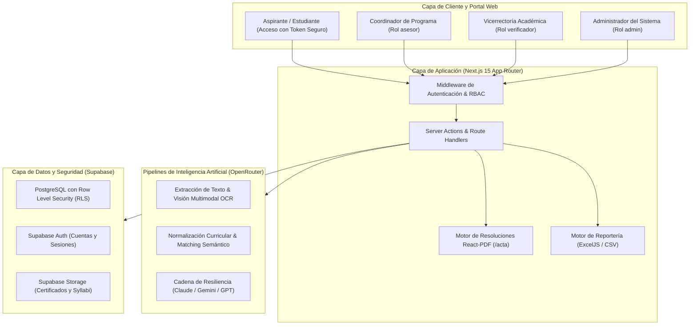

<p align="center">
  
</p>

<p align="center">
  <a href="#"></a>
  <a href="#"></a>
  <a href="#"></a>
  <a href="#"></a>
  <a href="#"></a>
  <a href="#"></a>
</p>

# IrisLab
### Sistema Inteligente de Homologaciones Académicas
**Corporación Universitaria Autónoma del Cauca**  
*Desarrollado por la Fábrica de Software · Powered by Emprendelab*

---

## 📌 Acerca de la Plataforma

**IrisLab** es la solución institucional integral desarrollada para la **Corporación Universitaria Autónoma del Cauca**, diseñada para transformar, acelerar y dotar de rigor jurídico el proceso de homologación y reconocimiento de asignaturas cursadas por aspirantes y transferencias externas (provenientes del SENA, universidades nacionales e internacionales, o transferencias de programa).

La plataforma reemplaza la revisión física manual y el cotejo artesanal de pensums por un flujo asistido por Inteligencia Artificial y validación humana garantizada. Desde la radicación digital del expediente hasta la expedición de la **Resolución Oficial de Vicerrectoría Académica** con su respectivo código QR y la proyección curricular de matrícula del **Artículo 3°**, IrisLab garantiza trazabilidad, transparencia y cumplimiento de los estatutos curriculares universitarios.

---

## 🏛️ Arquitectura del Sistema

IrisLab opera bajo una arquitectura moderna en la nube estructurada con **Next.js 15 (App Router)**, PostgreSQL con Row Level Security (RLS) en **Supabase**, canal transaccional de IA sobre **OpenRouter** y generación vectorial de documentos legales mediante **React-PDF**.



---

## 👥 Flujos de Trabajo por Rol

IrisLab implementa un modelo de control de acceso basado en roles (RBAC) con 4 perfiles claramente delimitados:

1. **Aspirante / Estudiante (`estudiante`):**
   - Radica su solicitud sin fricciones o consulta su estado confidencialmente mediante un **Token de Seguimiento Criptográfico Seguro** (`/seguimiento/[token]`).
   - Monitorea el dictamen en tiempo real, el porcentaje de créditos homologados y descarga la Resolución Oficial en PDF una vez expedida.
2. **Coordinador de Programa (`asesor`):**
   - Radica expedientes en `/casos/nuevo` con identificación completa, IES de origen y cargue de PDFs.
   - Analiza las equivalencias sugeridas por la IA en el estudio interactivo `/casos/[id]`.
   - Utiliza la barra secuencial (`[◀ Anterior]`, `[Siguiente ▶]`, `[⚡ Próxima pendiente]`), los chips diana `[🎯 Ir a Asignatura]` y las píldoras de filtrado por semestres `[Todos]`, `[S1]` a `[S9]`.
   - Gestiona el **Artículo 3°** (Cursos a Matricular) mediante el algoritmo de proyección inteligente (priorizando materias rezagadas, semestre de ingreso y semestres superiores hasta completar 5-6 materias) con reordenamiento interactivo.
   - Emite el veredicto final con notas públicas e internas.
3. **Vicerrectoría Académica / Verificador (`verificador`):**
   - Audita y filtra expedientes aprobados.
   - Asigna el consecutivo legal oficial (**`N.° de Resolución`**) de acuerdo con el Libro Radicador de Vicerrectoría.
   - Fija el período académico de ingreso y la fecha límite de pago de matrícula.
   - Genera, inspecciona y descarga la **Resolución Oficial en PDF** (Artículos 1°, 2°, 3° y 4°, sellos de Vigilada Mineducación, firmas y código QR).
   - Administra el estado de inscripción (`Pendiente de contacto`, `Contactado`, `Inscrito`) y el checklist de asignaturas formalizadas.
4. **Administrador del Sistema (`admin`):**
   - Administra las cuentas de usuario y la asignación de roles.
   - Carga y edita las mallas curriculares y versiones de pensum en `/carreras`.
   - Parametriza la identidad institucional (nombre, logos SVG, paleta de colores corporativa y nota mínima de aprobación) en `/configuracion`.
   - Monitorea estadísticas de gestión en `/reportes` y exporta la base consolidada a Excel (`.xlsx` multihoja con detalle y resumen) y `.csv` en `/casos/export`.

---

## 📚 Documentación Oficial y Manuales de Usuario

En la carpeta [`docs/manuales/`](file:///Users/salomontilla/Fabrica_Software/homologaciones/docs/manuales/README.md) se encuentra disponible la suite exhaustiva de manuales paso a paso:

- 📘 [**Manual del Coordinador de Programa**](file:///Users/salomontilla/Fabrica_Software/homologaciones/docs/manuales/01_MANUAL_COORDINADOR.md): Guía operativa de radicación, navegación secuencial, homologaciones N:1 y editor del Artículo 3°.
- ⚖️ [**Manual de Vicerrectoría Académica**](file:///Users/salomontilla/Fabrica_Software/homologaciones/docs/manuales/02_MANUAL_VICERRECTOR.md): Asignación de número de resolución, gestión de inscripción y emisión de actos legales en PDF.
- 🛠️ [**Manual del Administrador del Sistema**](file:///Users/salomontilla/Fabrica_Software/homologaciones/docs/manuales/03_MANUAL_ADMINISTRADOR.md): Gestión de usuarios RBAC, mallas curriculares, marca institucional y exportación analítica.
- 🎓 [**Guía del Aspirante / Estudiante**](file:///Users/salomontilla/Fabrica_Software/homologaciones/docs/manuales/04_MANUAL_ESTUDIANTE.md): Consulta por token criptográfico, lectura de avance y descarga de resolución.
- 📑 [**Índice General y Matriz de Permisos**](file:///Users/salomontilla/Fabrica_Software/homologaciones/docs/manuales/README.md): Glosario, matriz de capacidades y ciclo de vida integral.

---

## 🚀 Puesta en Marcha e Instalación

### Requisitos Previos
- **Node.js:** Versión 18.18+ o superior.
- **Gestor de Paquetes:** [pnpm](https://pnpm.io/) (recomendado v9+).
- **Entorno de Datos:** [Docker Desktop](https://www.docker.com/) (para ejecución local de Supabase) o proyecto en la nube de Supabase.
- **Supabase CLI:** Para gestión de migraciones y base de datos local.
- **Llave de IA:** Cuenta activa en [OpenRouter](https://openrouter.ai/) con modelos habilitados.

### Pasos de Instalación

1. **Clonar el repositorio:**
   ```bash
   git clone https://github.com/uniautonoma/irislab-homologaciones.git
   cd irislab-homologaciones
   ```

2. **Instalar dependencias del proyecto:**
   ```bash
   pnpm install
   ```

3. **Iniciar el entorno local de Supabase (PostgreSQL, Auth, Storage):**
   ```bash
   pnpm db:start
   ```

4. **Aplicar migraciones y datos semilla (Planes de estudio y pensums reales):**
   ```bash
   pnpm db:reset
   ```
   > [!NOTE]
   > `pnpm db:reset` reconstruye la base de datos aplicando todas las migraciones en `supabase/migrations/` y poblando los planes académicos autorizados desde `supabase/seed.sql`. Si únicamente desea aplicar cambios pendientes sin resetear datos, utilice `pnpm db:migrate`.

5. **Configurar las variables de entorno:**
   ```bash
   cp .env.example .env.local
   ```
   Diligencie los valores conforme a la tabla de configuración descrita abajo.

6. **Iniciar el servidor de desarrollo:**
   ```bash
   pnpm dev
   ```
   Abra [http://localhost:3000](http://localhost:3000) en su navegador web.

---

## ⚙️ Variables de Entorno

| Variable | Ámbito | Descripción |
| :--- | :---: | :--- |
| `NEXT_PUBLIC_SUPABASE_URL` | Público | URL del endpoint de Supabase (local o en la nube). |
| `NEXT_PUBLIC_SUPABASE_PUBLISHABLE_KEY` | Público | Clave anónima pública de Supabase. |
| `SUPABASE_SECRET_KEY` | Servidor | Clave secreta con rol de servicio (Service Role). **Nunca exponer en cliente**. |
| `OPENROUTER_API_KEY` | Servidor | Llave de API para el pipeline de IA en OpenRouter (Claude, Gemini, GPT). |
| `NEXT_PUBLIC_SITE_URL` | Público | URL base del despliegue para generación de códigos QR y enlaces de seguimiento. |
| `RESEND_API_KEY` | Servidor | Token de proveedor para despacho de correos transaccionales. |
| `CORREO_REMITENTE` | Servidor | Dirección de correo institucional de origen (ej. `admisiones@uniautonoma.edu.co`). |
| `NEXT_PUBLIC_TURNSTILE_SITE_KEY` | Público | Clave de sitio de Cloudflare Turnstile (protección anti-bots). |
| `TURNSTILE_SECRET_KEY` | Servidor | Clave secreta de validación del token Turnstile. |

---

## 💻 Scripts Disponibles

| Comando | Acción |
| :--- | :--- |
| `pnpm dev` | Inicia el servidor de desarrollo con Hot Module Replacement (HMR). |
| `pnpm build` | Compila la aplicación optimizada para producción. |
| `pnpm start` | Inicia el servidor Node.js en entorno de producción. |
| `pnpm db:start` | Levanta el stack local de Supabase mediante Docker. |
| `pnpm db:stop` | Detiene los contenedores locales de Supabase. |
| `pnpm db:migrate` | Ejecuta las migraciones SQL pendientes sin borrar datos existentes. |
| `pnpm db:reset` | Resetea la base local desde cero (migraciones completas + `seed.sql`). |
| `pnpm db:status` | Informa los puertos, URLs y claves de acceso del Supabase local. |

---

## 🚢 Despliegue en Producción

El proyecto está diseñado para desplegarse de manera óptima en infraestructuras compatibles con Next.js (Vercel, Railway, Coolify o servidores dedicados Docker):

1. **Configuración de Variables:** Importe todas las variables de entorno en el panel del proveedor.
2. **Tiempo Máximo de Ejecución:** Para endpoints que procesan OCR y visión por IA, la configuración del proyecto tiene fijado `maxDuration = 60` segundos en las Server Actions de análisis. Asegúrese de que su proveedor admita este límite en planes Serverless.
3. **Almacenamiento:** Valide que el bucket `certificados` en Supabase Storage cuente con permisos privados y políticas RLS activas.

---

## 🏛️ Créditos y Reconocimientos Institucionales

- **Institución:** Corporación Universitaria Autónoma del Cauca (Popayán, Colombia).
- **Desarrollo:** Desarrollado por la **Fábrica de Software · Powered by Emprendelab**.
- **Liderazgo del Proyecto:** Equipo de Innovación Tecnológica y Transformación Digital.
- **Licencia:** Propiedad institucional de la Corporación Universitaria Autónoma del Cauca. Todos los derechos reservados.
