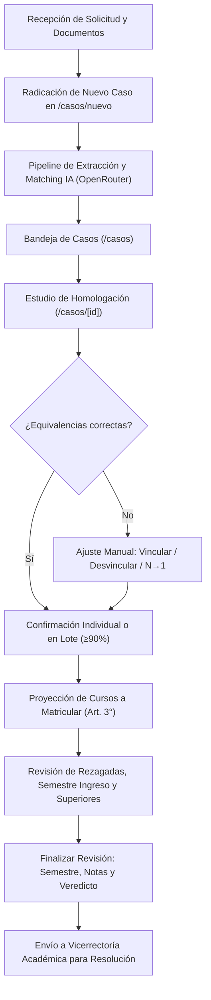
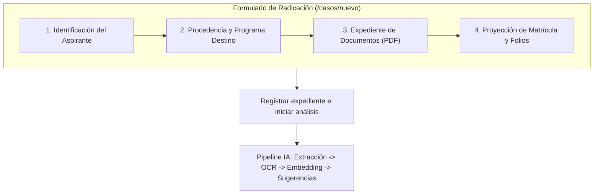
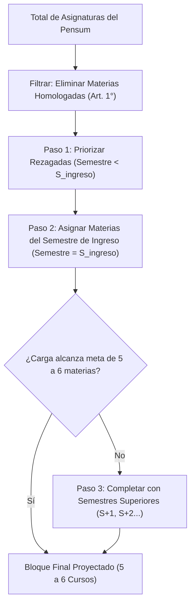

# IrisLab · Manual de Usuario: Coordinador de Programa
**Sistema Inteligente de Homologaciones Académicas**  
*Corporación Universitaria Autónoma del Cauca*  
*Desarrollado por la Fábrica de Software · Powered by Emprendelab*

---

## 1. Introducción y Rol del Coordinador

El rol de **Coordinador de Programa** (identificado en la plataforma con privilegios de rol `asesor`) es el responsable académico de evaluar las solicitudes de homologación presentadas por aspirantes y transferencias externas. 

El Coordinador tiene a su cargo:
- La **radicación de nuevos expedientes** académicos en `/casos/nuevo`.
- El **análisis técnico y pedagógico de equivalencias** de asignaturas en el estudio interactivo `/casos/[id]`.
- La **validación o ajuste de sugerencias emitidas por los pipelines de Inteligencia Artificial**.
- La **definición de la carga académica de ingreso** (Artículo 3° de la Resolución Oficial).
- La **emisión del veredicto final** (Aprobación o Rechazo formal) y la asignación del semestre definitivo.



---

## 2. Acceso al Sistema y Bandeja de Casos

### 2.1. Inicio de Sesión
1. Ingrese a la URL institucional de IrisLab: `https://homologaciones.uniautonoma.edu.co/ingresar`.
2. Ingrese su correo electrónico institucional (`@uniautonoma.edu.co`) y contraseña autorizada.
3. El sistema autentica las credenciales con Supabase Auth y redirige automáticamente a la **Bandeja de Casos** (`/casos`).

> [!NOTE]
> Su cuenta cuenta con Row Level Security (RLS) habilitado. Si es Coordinador con rol `asesor`, tendrá acceso a los casos generales y a aquellos asignados específicamente a su programa académico.

---

### 2.2. Interfaz de la Bandeja de Casos (`/casos`)

La bandeja centraliza todos los expedientes en trámite. Cuenta con tres áreas principales:

1. **Tarjetas de Estadísticas (KPIs):**
   - **Por revisar (Ámbar):** Casos procesados por la IA pendientes de dictamen del coordinador. Si un caso supera los 3 días hábiles en este estado, el sistema emite una alerta visual de SLA.
   - **Procesando (Azul):** Casos cuyos PDFs están siendo analizados por el pipeline de extracción y visión OCR.
   - **Casos totales (Gris):** Consolidado histórico de solicitudes.

2. **Filtros Dinámicos y Buscador Inteligente:**
   - **Pestañas de Estado:** `[Todos]`, `[Por revisar]`, `[Procesando]`, `[Aprobados]`, `[Rechazados]`. Cada pestaña muestra el conteo exacto en tiempo real.
   - **Buscador global:** Permite filtrar instantáneamente por nombre del solicitante, correo electrónico o institución universitaria de procedencia.
   - **Filtro de fechas:** Rangos preestablecidos (Hoy, Últimos 7 días, Este mes, Histórico) o selección personalizada de fechas.

3. **Acceso a Radicación:**
   - Botón superior derecho: **`+ Nuevo caso`**, que dirige directamente a `/casos/nuevo`.

---

## 3. Radicación de Nuevos Casos (`/casos/nuevo`)

El formulario de radicación oficializa la solicitud ante la Corporación Universitaria Autónoma del Cauca, estructurando el expediente para el motor de Inteligencia Artificial.



### 3.1. Sección 1: Identificación del Aspirante
Todos los datos legales requeridos para la emisión de la Resolución de Homologación:
- **Nombre completo (*):** Nombres y apellidos tal como constan en el documento de identidad oficial (ej. *Juan Alexander Pérez Urbano*).
- **Cédula / Documento de identidad (*):** Número de identificación sin puntos ni comas.
- **Lugar de expedición del documento (*):** Ciudad y departamento (ej. *Popayán (Cauca)*).
- **Correo electrónico:** Dirección para notificaciones automáticas y envío del token de seguimiento seguro.
- **Celular / WhatsApp:** Teléfono de contacto directo para admisiones.

### 3.2. Sección 2: Procedencia Académica y Programa Destino
- **Carrera de la Autónoma del Cauca (Destino) (*):** Selección del pensum curricular oficial vigente (ej. *Ingeniería de Software y Computación*, *Administración de Empresas*).
- **Institución de Educación Superior de Origen (*):** Búsqueda asistida de la universidad o institución técnica/tecnológica (ej. *SENA*, *Universidad del Cauca*, *Universidad del Valle*).
- **Programa o carrera de procedencia (*):** Nombre exacto del programa cursado (ej. *Tecnología en Análisis y Desarrollo de Software - ADSO*).

### 3.3. Sección 3: Expediente de Documentos Oficiales (PDF)
- **Certificado oficial de calificaciones (PDF Obligatorio):**
  - Admite archivos en formato `.pdf` de hasta 15 MB.
  - Puede arrastrar y soltar el archivo en la zona punteada o hacer clic para examinarlo.
  - Si el certificado es un escaneo físico sin capa de texto vectorial, el pipeline activará automáticamente visión multimodal por IA.
- **Contenidos programáticos o syllabi (PDF Opcional):**
  - Permite cargar múltiples archivos PDF de apoyo con los microcurrículos cursados.
  - Permite adjuntar, visualizar tamaño individual y limpiar la lista antes de enviar.

### 3.4. Sección 4: Proyección de Matrícula y Folios
- **Período de matrícula proyectado:** Período académico en el que ingresará el estudiante (ej. *1P-2026* o *2P-2026*).
- **Fecha límite pago matrícula:** Selector de fecha límite según el calendario institucional.
- **Folios solicitud formal:** Número de hojas que componen la solicitud escrita (por defecto `1`).

> [!IMPORTANT]
> Al presionar el botón **`Registrar expediente e iniciar análisis`**, el sistema sube los documentos al almacenamiento seguro de Supabase Storage, invoca la cadena de IA para extraer las materias y generar los emparejamientos preliminares, y redirige automáticamente a la pantalla de estudio `/casos/[id]`.

---

## 4. Estudio y Revisión de Equivalencias (`/casos/[id]`)

La pantalla de estudio es el área de trabajo interactiva del Coordinador. En pantalla de escritorio presenta dos columnas sincronizadas:
- **Columna Izquierda (Origen):** Materias cursadas y certificadas por la institución de procedencia.
- **Columna Derecha (Destino):** Asignaturas del plan de estudios de la Autónoma del Cauca, agrupadas por semestre.

```
+----------------------------------------------------------------------------------------------------+
|  [Barra Superior]  Progreso: 14 de 20 (70%)  |  Semestre sugerido: 4  |  [Ver Cert]  [Ver Pensum]  |
+----------------------------------------------------------------------------------------------------+
|  COLUMNA ORIGEN (Institución Procedencia)           |  COLUMNA DESTINO (Autónoma del Cauca)        |
|  [Buscador: "cálculo" (1 de 20)]                   |  [Buscador asignatura...] [Todos][S1]..[S9]  |
|  [◀ Ant] Materia 3 de 20 [Sig ▶] [⚡ Próx. pendiente]|                                              |
|  [+ Agregar materia]  [Selección múltiple]         |  ▼ Semestre 1                                |
|                                                    |    [Tarjeta Asignatura: Álgebra Lineal]      |
|  [Tarjeta Origen: Matemáticas Operativas]          |  ▼ Semestre 2                                |
|    • Nota: 4.2 · Créditos: 3                       |    [Tarjeta Asignatura: Cálculo Diferencial] |
|    • [🎯 Ir a Cálculo Diferencial (S2)]            |       • Similitud: 92% (Confirmada)          |
+----------------------------------------------------------------------------------------------------+
|  [Barra Flotante Inferior]: Vincular / Confirmar Sugerencia IA / Desvincular                       |
+----------------------------------------------------------------------------------------------------+
```

---

### 4.1. Barra de Navegación Secuencial y Filtros Rápidos

Para acelerar la revisión de expedientes voluminosos (como certificados del SENA con más de 30 competencias o universidades con 40 asignaturas), el encabezado de la columna Origen dispone de una barra de control rápido:

1. **`[◀ Anterior]` y `[Siguiente ▶]`:**
   - Permiten desplazarse cronológicamente por cada materia del origen.
   - El contador central `Materia X de Y` mantiene la ubicación exacta en el expediente.
2. **`[⚡ Próxima pendiente]`:**
   - Salta automáticamente a la siguiente materia del estudiante que aún no tenga un vínculo formalizado (aprobado o rechazado).
   - Si no quedan materias pendientes, el botón se desactiva mostrando el estado `Completadas`.
3. **Buscadores en Tiempo Real:**
   - Buscan simultáneamente por nombre de materia y código curricular, ignorando tildes, mayúsculas y acentos diacríticos.
4. **Píldoras de Filtrado Semestral (Columna Destino):**
   - En la parte superior de la columna Destino se ubica la barra de navegación: `[Todos]`, `[S1]`, `[S2]`, `[S3]`, `[S4]`, `[S5]`, `[S6]`, `[S7]`, `[S8]`, `[S9]`.
   - Al pulsar un chip semestral (ej. `[S4]`), la columna realiza un scroll suave inmediato hasta el bloque del cuarto semestre del pensum.

---

### 4.2. Chips de Salto Rápido `[🎯 Ir a Asignatura]`

Cuando una materia de origen ya posee una sugerencia de la IA o un vínculo en estudio:
- La tarjeta de origen despliega uno o más chips identificados con el ícono diana: `[🎯 Ir a Nombre Asignatura (SX)]`.
- Al pulsar este chip, la interfaz hace foco automático y desplaza la columna derecha directamente hacia la tarjeta de la asignatura destino correspondiente, resaltándola visualmente.

---

### 4.3. Reglas de Vinculación y Homologaciones N:1

El sistema admite tres modos de asociación:

1. **Confirmación de Sugerencia de IA (1 a 1):**
   - La IA muestra el porcentaje de similitud semántica y temática:
     - **Verde (≥ 85%):** Alta concordancia.
     - **Ámbar (70% - 84%):** Coincidencia parcial que amerita revisión de créditos y temarios.
     - **Rojo (< 70%):** Baja confianza.
   - Al hacer clic en la tarjeta de origen, la barra inferior flotante muestra la justificación académica formulada por la IA.
   - Presione **`Confirmar vinculación`** en la barra inferior para aprobarla.

2. **Vinculación Manual Directa:**
   - Haga clic en una materia de origen.
   - Haga clic en la asignatura destino deseada.
   - En la barra inferior flotante, pulse **`Vincular`**.

3. **Homologación Múltiple (Varios a Uno - N:1):**
   - Ideal para casos del SENA o ciclos propedéuticos donde dos asignaturas técnicas equivalen a una asignatura universitaria (ej. *Lógica de Programación* + *Estructuras de Control* ➔ *Algoritmos y Programación*).
   - Active el botón **`Seleccionar varias`** en la columna de origen.
   - Marque las 2 o más materias de origen correspondientes.
   - Seleccione la asignatura destino en la columna derecha.
   - En la barra flotante pulse **`Vincular las X materias`**.

4. **Confirmación en Lote (`≥ 90%`):**
   - Si el expediente cuenta con múltiples sugerencias de muy alta confianza, en la barra superior se habilita el botón **`Confirmar X ≥ 90%`**, aprobando todas las coincidencias seguras en un solo clic.

> [!WARNING]
> El sistema valida automáticamente las políticas académicas institucionales:
> - Si la nota obtenida es inferior a la nota mínima de aprobación configurada en la institución (ej. `< 3.0`), la tarjeta mostrará una advertencia roja: `Nota X.X (mín. 3.0)`.
> - Si los créditos de la asignatura destino superan los créditos de origen, se mostrará la alerta `Créditos O → D`.

---

### 4.4. Edición y Adición Manual de Materias de Origen

Si la extracción automática del PDF omitió alguna materia debido a una resolución deficiente del escaneo:
- Presione **`+ Agregar materia`** para registrar el nombre, código, créditos, semestre y nota certificada.
- En cualquier materia existente, pulse el ícono de lápiz para corregir nombres, créditos o notas leídas incorrectamente.

---

## 5. Gestión de Cursos a Matricular (Artículo 3° de la Resolución)

Una vez definidas las materias homologadas, el sistema genera la **Proyección Académica Oficial de Matrícula**, la cual conforma el **Artículo 3°** del acto administrativo oficial.



### 5.1. Algoritmo de Sugerencia Automática
El motor aplica el algoritmo de proyección inteligente con base en las siguientes reglas:
1. **Exclusión estricta:** Descarta todas las asignaturas aprobadas en el Artículo 1° (por ID y por concordancia de nombre normalizado).
2. **Prioridad 1 (Rezagadas):** Asigna primero las materias de semestres anteriores al semestre de ubicación que hayan quedado pendientes, garantizando que el estudiante no arrastre vacíos en su cadena de prerrequisitos.
3. **Prioridad 2 (Semestre de Ingreso):** Asigna las asignaturas correspondientes al semestre curricular de ubicación.
4. **Prioridad 3 (Superiores inmediatas):** Si el bloque no alcanza el estándar de 5 a 6 materias regulares, toma materias del semestre inmediatamente siguiente (`Semestre + 1`).

---

### 5.2. Editor Interactivo de Cursos a Matricular

El Coordinador tiene total control para ajustar la proyección según la oferta de cursos del período:

```
+------------------------------------------------------------------------------------------+
|  CURSOS A MATRICULAR (ARTÍCULO 3°)                      [Proyección sugerida | Confirmado]|
|  Asignaturas que el aspirante debe cursar en su período de ingreso.                      |
+------------------------------------------------------------------------------------------+
|  [1] 101001 · Estructuras de Datos (Sem 3) · 3 Créditos           [▲] [▼] [✕ Eliminar]   |
|  [2] 101002 · Arquitectura de Software (Sem 4) · 3 Créditos       [▲] [▼] [✕ Eliminar]   |
|  [3] 101005 · Bases de Datos Avanzadas (Sem 4) · 3 Créditos       [▲] [▼] [✕ Eliminar]   |
|  [4] 101008 · Redes y Comunicaciones (Sem 4) · 3 Créditos         [▲] [▼] [✕ Eliminar]   |
|  [5] 101012 · Sistemas Operativos (Sem 4) · 3 Créditos            [▲] [▼] [✕ Eliminar]   |
+------------------------------------------------------------------------------------------+
|  Total proyectado: 5 asignaturas · 15 créditos académicos                                 |
|  [Selector: Elegir materia del pensum...        ▼] [+ Agregar asignatura]                 |
|  [Restablecer sugerencia base]                                  [💾 Guardar cursos]       |
+------------------------------------------------------------------------------------------+
```

1. **Reordenar Prioridades:** Use los botones `[▲]` y `[▼]` para ordenar las asignaturas según el itinerario prioritario.
2. **Eliminar Materia:** Si una materia no se ofertará en el semestre de ingreso, pulse `[✕]` para removerla.
3. **Agregar Asignatura del Pensum:** En el menú desplegable agrupado por semestre, elija cualquier asignatura disponible y pulse `[+ Agregar asignatura]`.
4. **Restablecer Sugerencia:** El botón `[Restablecer sugerencia]` recalcula la proyección algorítmica óptima descartando modificaciones manuales.
5. **Guardar Cambios:** Pulse **`[Guardar cursos de matrícula]`** para persistir la selección en la base de datos y vincularla a la Resolución.

---

## 6. Finalización de la Revisión y Emisión de Veredicto

Cuando el estudio de homologación y la proyección de matrícula están concluidos:
1. En la barra superior, haga clic en el botón principal: **`Finalizar revisión`**.
2. Se desplegará el **Modal Compacto de Confirmación**:
   - **Semestre Definitivo:** Confirme o ajuste el número de semestre en el que se ubicará al estudiante (sugerido por el acumulado de créditos).
   - **Nota para el estudiante (Opcional):** Mensaje público que aparecerá en el acta y en el portal del aspirante (ej. *"Debe presentar los programas analíticos físicos durante la inducción"*). Cuenta con selector de plantillas preconfiguradas.
   - **Nota interna (Confidencial):** Observación técnica privada que solo verá el equipo de coordinación y vicerrectoría.
3. Seleccione el veredicto:
   - **`Aprobar caso` (Verde):** Cierra la revisión, genera el registro de homologación y traslada el caso a la bandeja de Vicerrectoría Académica para su firma y expedición de Resolución.
   - **`Rechazar caso` (Rojo):** Registra el no cumplimiento de condiciones curriculares mínimas.

> [!TIP]
> Si cometió algún error al finalizar, un usuario con rol de Coordinador o Administrador puede ingresar al caso y presionar **`Reabrir revisión`**, devolviendo el expediente al estado activo sin perder las equivalencias ya analizadas.
