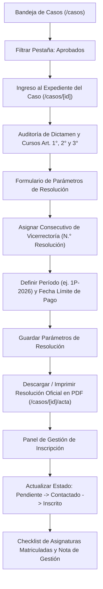
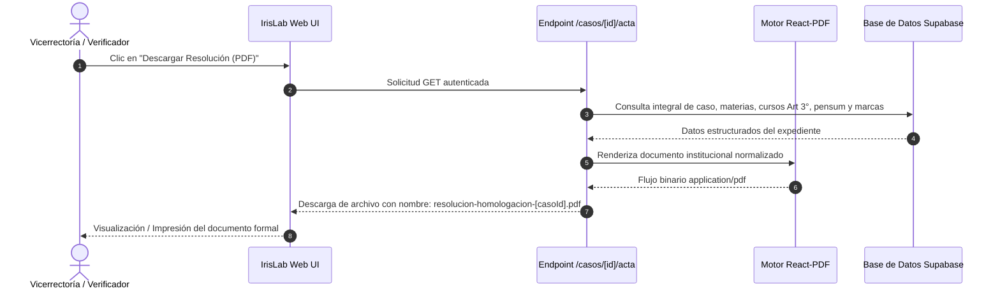

# IrisLab · Manual de Usuario: Vicerrectoría Académica / Verificador
**Sistema Inteligente de Homologaciones Académicas**  
*Corporación Universitaria Autónoma del Cauca*  
*Desarrollado por la Fábrica de Software · Powered by Emprendelab*

---

## 1. Introducción y Propósito del Rol

El rol de **Verificador / Vicerrectoría Académica** (identificado en la plataforma con el rol técnico `verificador`) es la máxima autoridad institucional encargada de refrendar, formalizar y otorgar validez jurídica a los estudios de homologación aprobados por las coordinaciones de programa.

Sus facultades en IrisLab comprenden:
- **Auditoría y control de legalidad** de los casos aprobados.
- **Asignación del consecutivo oficial (`N.° de Resolución`)** conforme al Libro Radicador Oficial de Resoluciones de Vicerrectoría.
- **Parametrización de los plazos financieros y académicos** (período de matrícula y fecha límite de pago).
- **Emisión, revisión y descarga de la Resolución Oficial en formato PDF** con plena fidelidad jurídica (Artículos 1°, 2°, 3° y 4°, sellos de vigilancia del Ministerio de Educación Nacional, código QR de verificación y firmas de ley).
- **Seguimiento a la matrícula efectiva** del estudiante y registro de trazabilidad del contacto.



---

## 2. Consulta y Filtrado de Casos Aprobados

1. Ingrese a la plataforma IrisLab con sus credenciales institucionales en `/ingresar`.
2. Diríjase a la sección **Casos** en la barra lateral de navegación (`/casos`).
3. En la barra de pestañas superiores, seleccione **`Aprobados`**.
   - La lista filtrará automáticamente todos los expedientes que ya fueron dictaminados favorablemente por los Coordinadores de Programa y que requieren trámite de resolución.
4. Para localizar un aspirante en particular, puede utilizar el buscador por:
   - Nombre o documento de identidad del aspirante.
   - Carrera de destino (ej. *Ingeniería de Software y Computación*).
   - Institución de procedencia (ej. *SENA*, *Universidad del Cauca*).
5. Haga clic sobre la tarjeta o fila del caso para acceder a la vista detallada del expediente `/casos/[id]`.

---

## 3. Parametrización del Acto Administrativo

Al ingresar a un caso con estado **Aprobado**, la interfaz presenta el resumen ejecutivo del caso y el panel **Resolución Oficial (Parámetros y Art. 3°)**:

```
+----------------------------------------------------------------------------------------------------+
|  RESOLUCIÓN OFICIAL (PARÁMETROS Y ART. 3°)                                                         |
|  Configura los datos del acto administrativo y la lista oficial de cursos a matricular.            |
+----------------------------------------------------------------------------------------------------+
|  N° Resolución          Período de matrícula           Fecha límite pago                           |
|  [ 045-2026          ]  [ 1P-2026                   ]  [ 15/02/2026             📅]                |
|                                                                                                    |
|                                                                [💾 Guardar parámetros]             |
+----------------------------------------------------------------------------------------------------+
```

### 3.1. Asignación del Consecutivo Oficial (`N.° de Resolución`)
- En el campo **N° Resolución**, ingrese el consecutivo correlativo oficial que corresponde en el Libro Radicador de Vicerrectoría Académica (ejemplo: `045`, `112-2026`).
- Si el acto está en borrador previo a la firma oficial, puede mantenerse temporalmente con la indicación `Pendiente` o `XXX`.

### 3.2. Período Académico y Fecha Límite de Pago
- **Período de matrícula:** Defina el semestre lectivo oficial en el cual se hará efectiva la vinculación del aspirante (ejemplo: `1P-2026` o `2P-2026`).
- **Fecha límite de pago:** Seleccione en el calendario la fecha máxima improrrogable para que el aspirante cancele los derechos pecuniarios de matrícula académica y financiera. Esta fecha se transcribirá textualmente en el cuerpo normativo de la resolución.

Presione **`Guardar parámetros`** para asegurar que estos datos se integren inmediatamente a la base de datos y al generador del documento oficial.

---

## 4. Estructura y Fidelidad de la Resolución Oficial en PDF

La resolución generada por IrisLab en la ruta `/casos/[id]/acta` replica estrictamente el formato institucional de la Corporación Universitaria Autónoma del Cauca, respetando la estructura jurídica y visual del estándar:



### 4.1. Anatomía del Documento Legal

1. **Encabezado Institucional:**
   - Logotipo oficial de la Corporación Universitaria Autónoma del Cauca.
   - Leyenda lateral: *"VIGILADA MINEDUCACIÓN"*.
   - Encabezado de resolución centrado:  
     `RESOLUCIÓN No. [XXX]`  
     *(Ciudad y Fecha de Expedición, ej. "03 de febrero de 2026")*
   - Epígrafe normativo: *"Por medio de la cual se autoriza la homologación y reconocimiento de asignaturas cursadas y aprobadas en otra institución de educación superior a un estudiante que ingresa a la Corporación Universitaria Autónoma del Cauca"*.

2. **Considerandos Jurídicos:**
   - Reseña de la solicitud escrita presentada por el aspirante con indicación de cédula y lugar de expedición.
   - Certificación de notas aportada de la institución de procedencia.
   - Concepto favorable emitido por la Coordinación de Programa con base en el estudio técnico de contenidos curriculares.

3. **Articulado Normativo (Resuelve):**
   - **Artículo 1° (Homologación y Calificaciones):**  
     Tabla oficial de asignaturas reconocidas. Cada fila presenta:
     - Asignatura cursada en la IES origen (con formateo de capitalización institucional y siglas preservadas: SENA, TIC, SQL, etc.).
     - Código Uniautónoma.
     - Asignatura Uniautónoma.
     - Semestre del pensum.
     - Número de créditos académicos reconocidos.
     - Intensidad horaria semestral.
     - Tipo (Teórica / Práctica / Teórico-Práctica).
     - Calificación final transferida (en escala numérica legal colombiana).
     - Fila final con la sumatoria consolidada de créditos homologados.
   - **Artículo 2° (Ubicación Semestral):**  
     Declaración expresa del semestre académico en el cual queda ubicado formalmente el estudiante en el plan de estudios destino.
   - **Artículo 3° (Cursos a Matricular en el Período):**  
     Tabla obligatoria con la relación de asignaturas que el estudiante debe inscribir obligatoriamente en su período de ingreso, indicando número correlativo, código, nombre, semestre, créditos, intensidad horaria y tipología.
   - **Artículo 4° (Régimen Financiero y Notificación):**  
     Plazos de liquidación, fecha límite de pago y procedimiento de notificación oficial al admitido.

4. **Firmas y Validación Institucional:**
   - Línea de firma para la **Vicerrectoría Académica**.
   - Línea de firma para la **Coordinación de Programa**.
   - **Código QR de Validación:** Enlace seguro de autenticación criptográfica que permite a cualquier autoridad verificar la autenticidad e inmutabilidad del documento contra la base de datos de IrisLab.

> [!NOTE]
> La descarga del PDF puede realizarse directamente desde el botón azul **`Descargar Resolución (PDF)`** ubicado en el encabezado del caso aprobado.

---

## 5. Gestión del Estado de Inscripción del Estudiante

El panel **Gestión de Inscripción** permite a Vicerrectoría y a la Dirección de Admisiones hacer seguimiento al proceso posterior a la expedición del acto administrativo:

```
+------------------------------------------------------------------------------------------+
|  GESTIÓN DE INSCRIPCIÓN                                                                  |
+------------------------------------------------------------------------------------------+
|  Estado del proceso:                                                                     |
|  [● Pendiente de contacto]    [● Estudiante contactado]    [● Inscrito (Activo)]         |
|                                                                                          |
|  Materias matriculadas (3 de 5 homologadas formalizadas):                                |
|  [✔] Algoritmos y Lógica de Prog.     ->  Fundamentos de Programación                    |
|  [✔] Bases de Datos I                 ->  Gestión de Bases de Datos                      |
|  [✔] Álgebra Lineal                   ->  Álgebra Lineal                                 |
|  [ ] Inglés Técnico I                 ->  Inglés I                                       |
|  [ ] Ética y Sociedad                 ->  Formación Ciudadana y Constitución             |
|                                                                                          |
|  Nota de la gestión:                                                                     |
|  [Se remitió copia de la resolución por correo y se generó el recibo de matrícula...]    |
|                                                                                          |
|                                                                  [💾 Guardar gestión]    |
+------------------------------------------------------------------------------------------+
```

### 5.1. Fases del Estado de Inscripción
- **Pendiente de contacto (Ámbar):** El aspirante aún no ha sido notificado formalmente por la universidad.
- **Estudiante contactado (Azul):** El aspirante recibió la resolución y se encuentra en proceso de legalización financiera o cargue en el sistema académico (SIES/ERP institucional).
- **Inscrito (Verde):** El aspirante canceló su matrícula y ya cuenta con registro de matrícula activo en la Corporación Universitaria Autónoma del Cauca.

### 5.2. Checklist de Asignaturas Matriculadas
Permite marcar casilla por casilla cuáles asignaturas de la resolución ya fueron cargadas y formalizadas en el sistema académico de registro y control, previniendo discrepancias entre el acto administrativo y el historial de notas activo.

### 5.3. Bitácora de Observaciones
Espacio reservado para que el verificador registre llamadas, acuerdos de pago o novedades documentales. Al pulsar **`Guardar gestión`**, los datos quedan sellados con fecha y usuario auditor.
