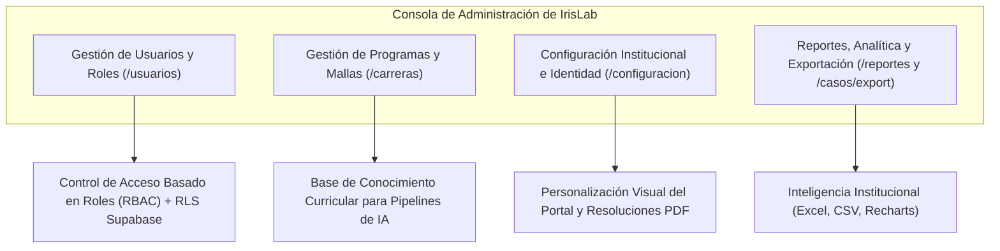
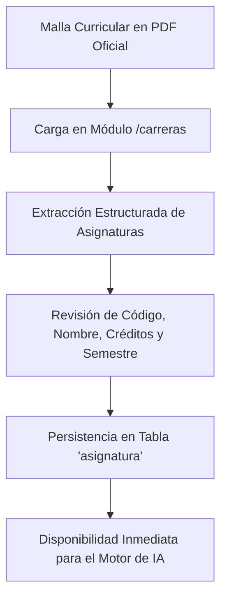
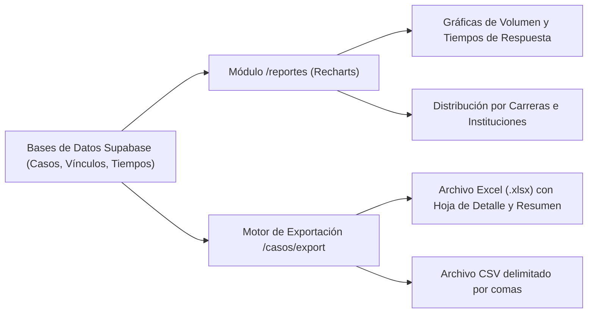

# IrisLab · Manual de Usuario: Administrador del Sistema
**Sistema Inteligente de Homologaciones Académicas**  
*Corporación Universitaria Autónoma del Cauca*  
*Desarrollado por la Fábrica de Software · Powered by Emprendelab*

---

## 1. Introducción y Rol del Administrador

El rol de **Administrador del Sistema** (`admin`) posee privilegios globales sobre la plataforma IrisLab. Es el responsable técnico de salvaguardar la infraestructura, gestionar los accesos del personal docente y directivo, actualizar los planes académicos de la institución, afinar las directrices de homologación y generar inteligencia de datos para la toma de decisiones institucionales.



---

## 2. Gestión de Usuarios y Control de Acceso (RBAC)

La administración de cuentas se realiza en la ruta `/usuarios`. IrisLab implementa un modelo de seguridad estricto que sincroniza `auth.users` con la tabla pública `perfil` y aplica políticas de Row Level Security (RLS) en la base de datos PostgreSQL.

### 2.1. Matriz de Roles y Facultades

| Rol en Sistema | Perfil Funcional | Permisos Clave |
| :--- | :--- | :--- |
| **`admin`** | Administrador Global / Director TI | Acceso total a todas las configuraciones, usuarios, pensums, reasignación de casos, reportería y auditoría. |
| **`asesor`** | Coordinador(a) de Programa Académico | Radicación de casos (`/casos/nuevo`), revisión del estudio de homologación (`/casos/[id]`), edición de materias, asignación de cursos Art. 3° y veredicto. |
| **`verificador`**| Vicerrectoría Académica / Admisiones | Consulta de casos aprobados, asignación de N.° de resolución, plazos de pago, seguimiento a matrícula y descarga de resoluciones PDF. |
| **`estudiante`** | Aspirante / Estudiante en Homologación | Vista pública o autenticada de solo lectura de su expediente y descarga de su acta oficial aprobada. |

---

### 2.2. Operaciones de Usuarios
1. **Crear / Invitar Nuevo Usuario:**
   - Ingrese a `/usuarios` y pulse **`+ Nuevo usuario`**.
   - Diligencie el nombre completo, correo electrónico institucional (`@uniautonoma.edu.co`) y asigne el rol correspondiente (`admin`, `asesor` o `verificador`).
   - El sistema genera la invitación en Supabase Auth y despacha el correo de bienvenida para la activación de credenciales.
2. **Modificar Roles y Accesos:**
   - En la tabla de usuarios, ubique al docente o funcionario y pulse **`Editar`**.
   - Puede ascender o revocar permisos modificando el selector de rol.
3. **Desactivación de Cuentas:**
   - Por motivos de seguridad y trazabilidad histórica, las cuentas no deben eliminarse si tienen casos o resoluciones firmadas; en su lugar, se suspende el acceso retirando sus roles operativos.

---

## 3. Gestión de Programas Académicos y Pensums (`/carreras`)

IrisLab utiliza la estructura de planes de estudio vigentes para ejecutar los cruces semánticos asistidos por Inteligencia Artificial y para alimentar el algoritmo de proyección de matrícula del Artículo 3°.



### 3.1. Creación de Carreras y Versiones de Pensum
1. Navegue a **Planes Académicos** (`/carreras`).
2. Haga clic en **`+ Nueva Carrera`**.
3. Registre los metadatos institucionales:
   - **Nombre oficial del programa:** (ej. *Ingeniería de Software y Computación*).
   - **Versión o código de pensum:** (ej. *Pensum 2024-1*).
   - **Resolución MEN de Registro Calificado:** (ej. *Resolución MEN N.° 012345 del 15 de julio de 2022*).

### 3.2. Carga y Edición de la Malla Curricular
- **Carga desde PDF Oficial:** Puede subir el documento PDF de la malla académica autorizada. El parser extraerá automáticamente el listado de materias distribuidas del semestre 1 al 10.
- **Editor en Línea de Asignaturas:**
  - Permite crear, modificar o suprimir materias de forma individual.
  - Cada asignatura debe registrar:
    - **Código de materia:** Clave alfanumérica única (ej. `101001`).
    - **Nombre de la asignatura:** Denominación exacta.
    - **Semestre:** Nivel curricular (1 al 10).
    - **Créditos académicos:** Valor numérico entero (ej. `3`).
    - **Intensidad horaria / Tipo:** Teórica, Práctica o Teórico-Práctica.

> [!IMPORTANT]
> Un pensum incompleto o sin créditos asignados afectará la exactitud del cálculo de semestre de ingreso y la sugerencia de cursos para el Artículo 3°. Verifique siempre la totalidad de la malla antes de activar la carrera.

---

## 4. Configuración Institucional e Identidad (`/configuracion`)

En la sección `/configuracion`, el Administrador define los parámetros legales y visuales que rigen para toda la Corporación Universitaria Autónoma del Cauca:

```
+------------------------------------------------------------------------------------------+
|  CONFIGURACIÓN GENERAL DE IRISLAB                                                        |
+------------------------------------------------------------------------------------------+
|  Parámetros de Homologación:                                                             |
|  • Nota mínima de aprobación: [ 3.0  ]                                                   |
|  • Nombre del Coordinador General: [ Ing. Carlos Alberto Gómez M. ]                      |
|                                                                                          |
|  Identidad Visual Institucional:                                                         |
|  • Nombre de la institución: [ Corporación Universitaria Autónoma del Cauca ]            |
|  • Color de acento primario: [ #002060 ] (Azul Uniautónoma)                              |
|  • Logotipo (Tema claro):    [ logo-uniautonoma-azul.svg ] [Cargar nuevo]                |
|  • Logotipo (Tema oscuro):   [ logo-uniautonoma-blanco.svg ] [Cargar nuevo]              |
|  • Eslogan institucional:    [ Educación para el Desarrollo y la Innovación ]            |
|                                                                                          |
|                                                                   [💾 Guardar ajustes]   |
+------------------------------------------------------------------------------------------+
```

### 4.1. Parámetros de Homologación Académica
- **Nota Mínima de Aprobación:** Umbral legal para admitir una homologación (por defecto `3.0` en la escala colombiana de 0.0 a 5.0). Si un estudiante presenta una nota inferior, el sistema advertirá inmediatamente al coordinador y bloqueará la vinculación por defecto.
- **Nombre de Coordinación / Directiva:** Nombre y cargo predeterminado para las firmas en las Resoluciones oficiales.

### 4.2. Identidad Visual y Marca
- **Logotipos Institucionales:** Carga de imágenes vectoriales SVG o PNG de alta fidelidad que se insertan en la cabecera de las resoluciones PDF y en el encabezado del portal web.
- **Paleta de Colores:** Configuración del color de marca (`brand color`), sincronizado dinámicamente con Tailwind CSS tanto en modo claro como en modo oscuro.

---

## 5. Monitoreo, Reportes y Exportación Masiva

IrisLab incorpora un centro de análisis de datos para auditoría y planeación académica en `/reportes` y en los endpoints de exportación `/casos/export`.



### 5.1. Cuadro de Mando y Analítica (`/reportes`)
- **Tasa de Aprobación vs. Rechazo:** Relación porcentual de expedientes resueltos.
- **Top de Instituciones de Procedencia:** Gráfica de barras identificando los orígenes más frecuentes (SENA, Universidades públicas, privadas o transferencias internacionales).
- **Demanda por Programa Académico:** Conteo de solicitudes recibidas por carrera destino.
- **Monitoreo de SLAs:** Detección de cuellos de botella en casos que excedan los tiempos ideales de revisión.

---

### 5.2. Exportación de Datos a Excel y CSV

En la cabecera de `/casos` o invocando el endpoint `/casos/export`, el Administrador puede descargar los datos consolidados:

1. **Exportación a Excel (`.xlsx`):**
   - Estructurado mediante la librería `ExcelJS`.
   - Incluye estilos corporativos, filtros automáticos y tipos de datos numéricos/fechas formateados.
   - Si se activa el parámetro `?resumen=1`, el libro incorpora una segunda hoja llamada **"Resumen"** con tablas dinámicas de totales por estado, programa e institución.
2. **Exportación a CSV:**
   - Archivo plano con codificación UTF-8, apto para integraciones con el sistema ERP institucional, software de admisiones o analítica externa en Power BI / Python.
   - Campos exportados: Solicitante, Documento, Correo, Celular, Institución Origen, Carrera Destino, Estado, Semestre Sugerido, Consecutivo de Resolución y Fecha de Creación.
