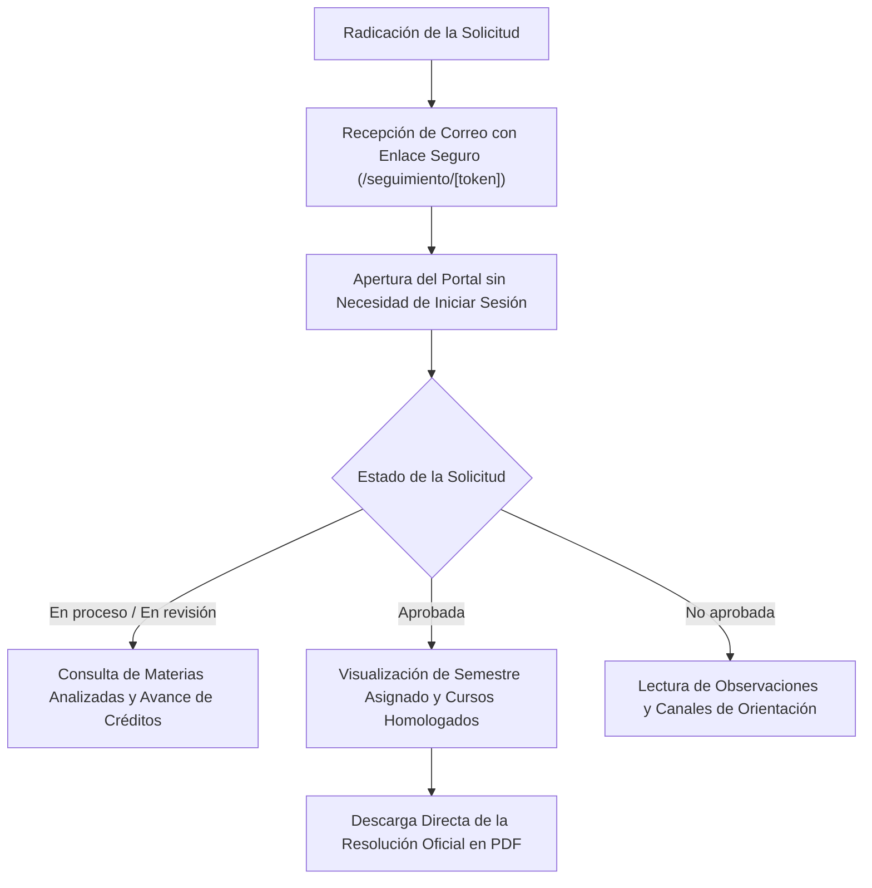

# IrisLab · Guía de Consulta: Aspirante / Estudiante
**Sistema Inteligente de Homologaciones Académicas**  
*Corporación Universitaria Autónoma del Cauca*  
*Desarrollado por la Fábrica de Software · Powered by Emprendelab*

---

## 1. Bienvenido a IrisLab

Estimado(a) aspirante:  
Bienvenido a la Corporación Universitaria Autónoma del Cauca. **IrisLab** es la plataforma tecnológica desarrollada para que su proceso de homologación y reconocimiento de asignaturas previas (provenientes del SENA, de otras universidades o de transferencias internas) sea ágil, transparente y seguro.

Usted **no necesita crear contraseñas complejas ni recordar usuarios**. Desde el momento en que se radica su solicitud, el sistema le asigna un **Enlace de Seguimiento Seguro con Token Criptográfico**, permitiéndole consultar el avance de su trámite desde cualquier computador o teléfono móvil con total confidencialidad.



---

## 2. Cómo Consultar el Estado de su Homologación

### 2.1. Acceso mediante Enlace Seguro
1. Al momento de registrar su expediente, recibirá un correo electrónico automático de la Corporación Universitaria Autónoma del Cauca.
2. En el mensaje encontrará el botón o enlace directo:  
   `https://homologaciones.uniautonoma.edu.co/seguimiento/[su-token-seguro]`
3. Haga clic sobre el enlace. El sistema verificará la clave criptográfica y le presentará instantáneamente su expediente académico digital.

> [!TIP]
> Guarde este enlace en los marcadores o favoritos de su navegador web, o conserve el correo recibido. Este enlace es su credencial personal y única para consultar el caso en cualquier momento.

---

## 3. Comprensión de los Estados de su Solicitud

En la parte superior de su pantalla verá una insignia de color que describe la etapa exacta en la que se encuentra su trámite:

| Estado Visual | Color e Ícono | Significado Académico | Qué debe hacer usted |
| :--- | :--- | :--- | :--- |
| **En proceso** | Azul `[⏱]` | El sistema y los modelos de Inteligencia Artificial están procesando su certificado de notas y extrayendo los contenidos. | Espere unos minutos. El proceso inicial toma entre 1 y 5 minutos. |
| **En revisión** | Ámbar `[⏱]` | Su expediente ya fue pre-analizado y se encuentra en manos del Coordinador(a) del Programa Académico para el dictamen pedagógico. | El comité curricular está evaluando las equivalencias. No requiere realizar ninguna acción. |
| **Aprobada** | Verde `[✔]` | ¡Felicitaciones! Su homologación ha sido aprobada favorablemente por la Coordinación de Programa y formalizada por Vicerrectoría Académica. | Revise las asignaturas aprobadas, el semestre asignado y descargue su resolución oficial en PDF. |
| **No aprobada** | Rojo `[✖]` | La solicitud no cumplió con las condiciones reglamentarias (ej. contenidos no afines o notas por debajo del mínimo legal). | Lea atentamente la nota del coordinador al final de la página y contacte a la Dirección de Admisiones. |

---

## 4. Qué Información Encontrará en su Portal de Seguimiento

Cuando su caso esté en revisión o aprobado, podrá interactuar con las siguientes secciones:

```
+-----------------------------------------------------------------------------------------+
|  [Logo Uniautónoma]  Ingeniería de Software y Computación           [✔ Aprobada]        |
|                      Desde: SENA - Regional Cauca                                       |
+-----------------------------------------------------------------------------------------+
|  ¡Tu homologación ha sido aprobada!                                                     |
|  Quedas ubicado(a) en el Semestre 4 de la carrera.                                      |
|                                                                                         |
|  [📄 Descargar Resolución Oficial en PDF]                                               |
+-----------------------------------------------------------------------------------------+
|  Progreso Curricular:                                                                   |
|  Créditos homologados: 48 de 160 créditos totales (30% de la carrera completada)        |
+-----------------------------------------------------------------------------------------+
|  Detalle de Asignaturas Homologadas:                                                    |
|  • Algoritmos y Programación Básica   ➔  Fundamentos de Programación (3 Cr) · Sem 1     |
|  • Estructuras de Datos Lineales      ➔  Estructuras de Datos (3 Cr) · Sem 2            |
|  • Bases de Datos Relacionales        ➔  Gestión de Bases de Datos (3 Cr) · Sem 3        |
|  • Inglés Técnico para Desarrolladores➔  Inglés I (2 Cr) · Sem 1                        |
+-----------------------------------------------------------------------------------------+
|  Nota de la Coordinación de Programa:                                                   |
|  "Favor presentarse a la jornada de inducción con su documento de identidad original."   |
+-----------------------------------------------------------------------------------------+
```

1. **Veredicto y Semestre de Ubicación:**  
   Si fue aprobado, verá el semestre en el cual iniciará sus estudios en la Autónoma del Cauca.
2. **Medidor de Avance Curricular:**  
   Un gráfico interactivo que ilustra cuántos créditos académicos de la carrera le han sido reconocidos y cuántos le restan para optar a su título profesional.
3. **Tabla de Equivalencias Aprobadas:**  
   Relación detallada que indica qué materia cursó en su institución anterior y a qué asignatura del plan de estudios de la Autónoma del Cauca equivale.
4. **Mensaje Oficial del Coordinador:**  
   Instrucciones personalizadas sobre fechas de inducción, presentación de certificados o entrega de documentos adicionales en la oficina de Admisiones.

---

## 5. Descarga de la Resolución Oficial en PDF

Una vez que Vicerrectoría Académica expide la Resolución Oficial:
1. En la parte superior de su pantalla se activará el botón: **`Descargar Resolución Oficial (PDF)`**.
2. Al hacer clic, se descargará en su dispositivo el documento formal autenticado con:
   - Consecutivo oficial de Resolución de Vicerrectoría.
   - Detalle de materias aprobadas (Artículo 1°).
   - Semestre oficial asignado (Artículo 2°).
   - Asignaturas que debe matricular en su primer semestre (Artículo 3°).
   - Código QR de verificación institucional que certifica la validez legal del documento ante cualquier entidad.
3. Presente este documento en la Oficina de Registro y Control Académico para formalizar su matrícula académica.

---

## 6. Soporte y Atención al Aspirante

Si tiene preguntas sobre el resultado de su estudio o requiere orientación sobre la financiación de su matrícula:
- **Dirección de Admisiones y Mercadeo:** Calle 5 No. 3-29, Popayán, Cauca.
- **Correo Electrónico:** `admisiones@uniautonoma.edu.co`
- **Línea de Atención / WhatsApp:** (+57) 314 890 2865
- **Horario de Atención:** Lunes a Viernes de 8:00 a.m. a 12:00 m. y de 2:00 p.m. a 6:00 p.m.
