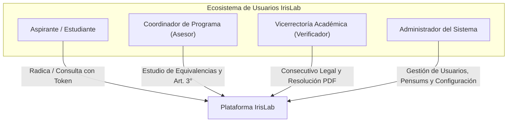
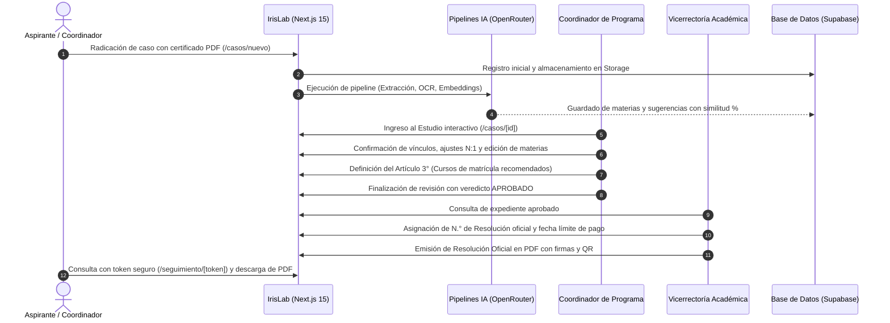

# IrisLab · Centro de Documentación y Manuales de Usuario
**Sistema Inteligente de Homologaciones Académicas**  
*Corporación Universitaria Autónoma del Cauca*  
*Desarrollado por la Fábrica de Software · Powered by Emprendelab*

---

## 1. Visión General

Bienvenido a la suite oficial de manuales de usuario de **IrisLab**, la plataforma institucional de la Corporación Universitaria Autónoma del Cauca diseñada para la digitalización, automatización inteligente y formalización jurídica del proceso de homologación y reconocimiento de asignaturas.

Este centro de documentación consolida los roles de operación, sus atribuciones normativas, los flujos procedimentales y las guías interactivas paso a paso para cada uno de los actores que intervienen en el ecosistema académico.

---

## 2. Índice General de Manuales

Para acceder al manual especializado de cada rol, seleccione el documento correspondiente en la siguiente tabla:

| Guía Oficial | Destinatario Principal | Rol Técnico | Enfoque y Contenido Temático |
| :--- | :--- | :--- | :--- |
| [📘 **01. Manual del Coordinador**](./01_MANUAL_COORDINADOR.md) | Coordinadores de Programa Académico | `asesor` | Radicación de expedientes (`/casos/nuevo`), uso de la barra secuencial (`[◀]`, `[▶]`, `[⚡]`), chips de salto rápido `[🎯]`, vinculaciones N:1, proyección de cursos a matricular (Artículo 3°) y emisión de veredictos. |
| [⚖️ **02. Manual de Vicerrectoría**](./02_MANUAL_VICERRECTOR.md) | Vicerrector Académico y Equipo de Admisiones | `verificador` | Auditoría de casos aprobados, asignación del consecutivo oficial (`N.° de Resolución`), parametrización de plazos de matrícula y pago, seguimiento al estado de inscripción y descarga del acto formal en PDF. |
| [🛠️ **03. Manual del Administrador**](./03_MANUAL_ADMINISTRADOR.md) | Administradores de TI y Directivos | `admin` | Gobierno del sistema, gestión de usuarios y roles RBAC, parametrización de programas académicos y pensums, configuración visual de marca, cuadros de mando y exportación de datos (Excel / CSV). |
| [🎓 **04. Guía del Estudiante**](./04_MANUAL_ESTUDIANTE.md) | Aspirantes y Estudiantes en Homologación | `estudiante` / Público | Consulta confidencial de estado mediante token criptográfico (`/seguimiento/[token]`), lectura de avance curricular, retroalimentación del comité y descarga del acta aprobada. |

---

## 3. Matriz de Permisos y Capacidades por Rol

La plataforma IrisLab implementa políticas rigurosas de seguridad a nivel de base de datos (PostgreSQL Row Level Security - RLS) y validaciones en capa de servidor (Server Actions y Route Handlers de Next.js 15). A continuación se resume la matriz de capacidades:

| Capacidad Operativa | Aspirante (`estudiante`) | Coordinador (`asesor`) | Vicerrectoría (`verificador`) | Administrador (`admin`) |
| :--- | :---: | :---: | :---: | :---: |
| **Consultar caso vía Token Seguro** |  |  |  |  |
| **Radicar nuevo caso (`/casos/nuevo`)** |  |  |  |  |
| **Acceso a Bandeja de Casos (`/casos`)** |  |  |  |  |
| **Vincular y Desvincular Asignaturas** |  |  |  |  |
| **Editar Cursos a Matricular (Art. 3°)** |  |  |  |  |
| **Emitir Veredicto (Aprobar / Rechazar)**|  |  |  |  |
| **Reabrir Revisión de un Caso** |  |  |  |  |
| **Asignar Consecutivo de Resolución** |  |  |  |  |
| **Gestionar Checklist de Inscripción** |  |  |  |  |
| **Descargar Resolución Oficial en PDF** | *(Solo aprobado)* |  |  |  |
| **Administrar Usuarios y Roles** |  |  |  |  |
| **Crear y Modificar Pensums Académicos**|  |  |  |  |
| **Configurar Identidad de Marca Institucional**|  |  |  |  |
| **Exportar Base Consolidada (Excel / CSV)**|  |  |  |  |

---

## 4. Ciclo de Vida de una Homologación en IrisLab

---

## 5. Glosario de Términos Institucionales

- **Materia de Origen:** Asignatura o competencia certificada y cursada por el estudiante en la institución educativa de procedencia (ej. SENA, universidad externa).
- **Asignatura Destino:** Materia perteneciente a la malla curricular autorizada de la Corporación Universitaria Autónoma del Cauca.
- **Similitud Semántica (%):** Métrica calculada mediante modelos de procesamiento de lenguaje natural que evalúa la afinidad temática y de competencias entre el origen y el destino.
- **Artículo 1°:** Disposición del acto resolutivo que aprueba el reconocimiento de asignaturas con sus respectivas calificaciones homologadas y equivalencia de créditos.
- **Artículo 2°:** Disposición que sitúa al estudiante en un semestre académico determinado.
- **Artículo 3°:** Bloque obligatorio de asignaturas que el estudiante debe matricular en su período académico inicial de ingreso.
- **Token de Seguimiento:** Identificador alfanumérico pseudoaleatorio seguro que concede acceso restringido de solo lectura a un expediente sin requerir credenciales de usuario.

---

> [!NOTE]
> Para soporte técnico o solicitudes de capacitación en el uso de la plataforma, contacte a la **Fábrica de Software Powered by Emprendelab** a través de los canales internos autorizados de la Universidad.
